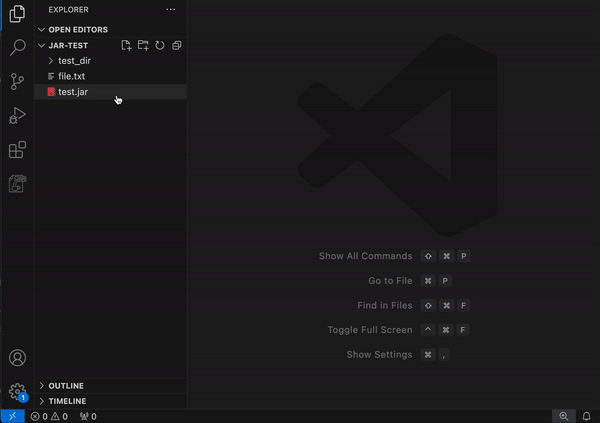

# jar-viewer-and-decompiler README

## Features

This extension allows you to browse the contents of Java JAR files. To launch this extension, right click on a .jar file in the VSCode explorer and select "Open With JAR Viewer and Decompiler".

Any Java class files in the JARs can be decompiled. Decompiling class files requires CFR to be available. Do NOT use this extension to decompile class files which you do not have legal rights to do so.

## Requirements

To view the decompiled contents of Java class files within JARs, the CFR decompiler JAR file needs to be downloaded and the path provided to the `cfrPath` setting. CFR can be downloaded [here](https://www.benf.org/other/cfr/).

## Extension Settings

This extension contributes the following settings:

* `jar-viewer-and-decompiler.cfrPath`: Path to the CFR decompiler JAR file. This is required for decompiling class files.

## Known Issues

* JAR files within JAR files can not be viewed.

## Release Notes

### 1.0.0

Initial release of extension.

---
